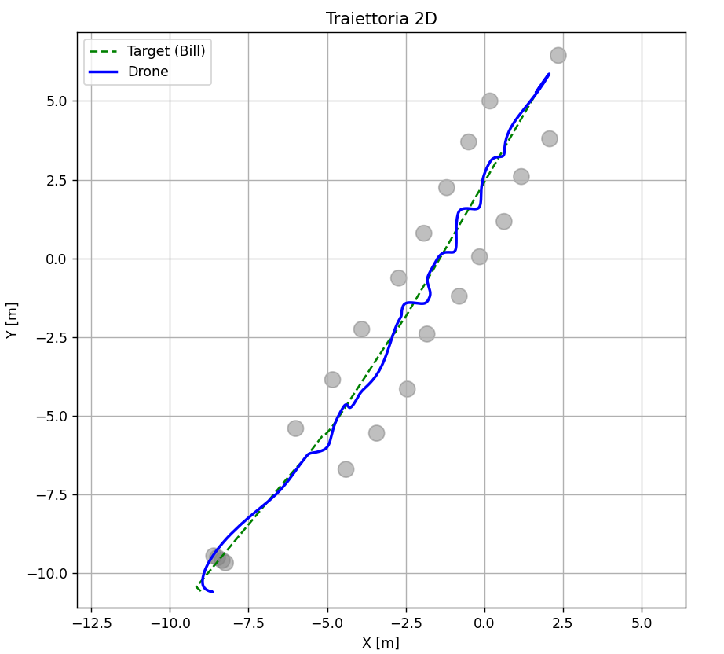

# 🚁 Reactive UAV Obstacle Avoidance using Vortex Vector Fields

<p align="center">
  
</p>

<p align="center">
<b>Reactive person-following for autonomous quadrotors using repulsive and vortex vector fields with heuristic stabilization.</b>
</p>

<p align="center">


</p>

---

# Overview

This repository presents a **fully reactive control architecture** for autonomous quadrotor navigation in cluttered environments.

Unlike classical navigation frameworks, the UAV **does not navigate toward a fixed global goal**. Instead, it continuously tracks a **virtual target** located behind a moving person while simultaneously avoiding obstacles through the combination of **repulsive** and **vortex vector fields**.

The controller operates entirely in real time and does not require any global path planner or map of the environment.

---

# Key Features

- Reactive UAV navigation
- Autonomous person following
- Virtual target generation
- Repulsive obstacle avoidance
- Vortex-based obstacle circumnavigation
- Dynamic vortex direction selection
- Velocity damping
- Low-pass force filtering
- Smooth tracking/avoidance blending
- Hysteresis-based obstacle activation
- Automatic CSV logging
- Real-time simulation in CoppeliaSim

---

# Control Pipeline

```
                  Bill
                   │
                   ▼
        Virtual Target Generation
                   │
                   ▼
         Person Following Controller
                   │
        ┌──────────┴──────────┐
        │                     │
        ▼                     ▼
Obstacle Detection      Relative Tracking
        │
        ▼
Repulsive Vector Field
        │
        ▼
Vortex Vector Field
        │
        ▼
Velocity Damping
        │
        ▼
Low-pass Filtering
        │
        ▼
Tracking / Avoidance Blending
        │
        ▼
Quadrotor Attitude Controller
```

---

# Obstacle Avoidance Strategy

The avoidance controller combines three complementary actions.

## 🔴 Repulsive Field

A repulsive force pushes the UAV away from nearby obstacles once they enter the influence region.

This guarantees collision avoidance but may generate oscillatory behaviour if used alone.

---

## 🌀 Vortex Field

A tangential vector field produces a lateral motion around the obstacle instead of simply pushing the UAV backwards.

The rotation direction is **computed dynamically** according to the relative position between the obstacle and the virtual target, allowing the UAV to naturally select the most convenient side for bypassing.

---

## ⚡ Velocity Damping

An additional damping term reduces aggressive reactions by considering the velocity component directed toward the obstacle.

This improves stability during close interactions.

---

The resulting avoidance action is

```math
F_{obs}=F_{rep}+F_{vor}+F_{damp}
```

which is then filtered and blended with the tracking controller before being sent to the quadrotor.

---

# Stabilization Heuristics

Several heuristic mechanisms are introduced to improve robustness and smoothness.

- Cubic activation of obstacle influence
- Independent low-pass filtering of repulsive and vortex forces
- Global force saturation
- Smooth blending between tracking and avoidance
- Hysteresis switching to prevent oscillatory behaviour
- Limited UAV inclination during aggressive maneuvers

These heuristics allow obstacle avoidance to behave as a bounded perturbation instead of dominating the tracking objective.

---

# Simulation Scenarios

| Scenario | Description |
|-----------|-------------|
| 🟢 Scenario 1 | Person following without obstacles |
| 🟡 Scenario 2 | Repulsive + vortex fields without stabilization heuristics |
| 🟠 Scenario 3 | Full stabilized controller |
| 🔵 Scenario 4 | Narrow corridor with dense obstacles |

---

# Simulation Results

## UAV Trajectory

<p align="center">

</p>

The UAV successfully bypasses obstacles while maintaining the desired relative position behind the moving target.

---

## Obstacle Avoidance Forces

<p align="center">

</p>

Repulsive and vortex contributions remain smooth thanks to low-pass filtering and blending.

---

## Corridor Navigation

<p align="center">

</p>

The controller performs continuous micro-corrections while maintaining bounded tracking error inside narrow passages.

---

# Repository Structure

```
.
├── media/
│   ├── gif.gif
│   ├── trajectory.png
│   ├── force_plot.png
│   └── corridor.png
│
├── lua/
│
├── scenes/
│
├── report/
│
├── presentation/
│
└── README.md
```

---

# Automatic Logging

Each simulation automatically exports:

- UAV trajectory
- Virtual target trajectory
- Obstacle distance
- Repulsive forces
- Vortex forces
- Attitude commands
- Obstacle map

The generated CSV files can be directly used for offline analysis and plotting.

---

# Technologies

- CoppeliaSim
- Lua
- Reactive Control
- Vector Fields
- Quadrotor Dynamics
- Obstacle Avoidance

---

# Future Improvements

Possible future extensions include:

- Dynamic obstacle prediction
- Multi-UAV coordination
- ROS2 integration
- Onboard depth camera perception
- MPC-based tracking controller
- Real-world UAV deployment

---

# Author

Developed as part of a research project on **reactive UAV navigation and obstacle avoidance using vortex vector fields**.
