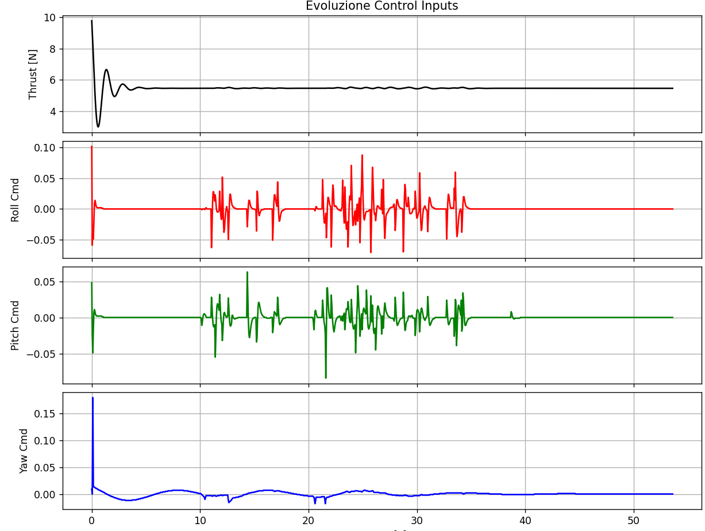

# 🚁 UAV Obstacle Avoidance using Vortex Vector Fields

<p align="center">
  
</p>

<p align="center">
<b>Reactive UAV person-following with vortex-based obstacle avoidance in CoppeliaSim.</b>
</p>

---

## Overview

This project presents a **fully reactive control architecture** for autonomous quadrotor person-following in cluttered environments.

Instead of navigating toward a fixed global goal, the UAV continuously tracks a **virtual target** located behind a moving person while avoiding surrounding obstacles through a combination of **repulsive** and **vortex vector fields**.

The controller operates entirely in real time and does **not require global path planning**, making it suitable for dynamic environments where rapid reactions are essential.

---

## Features

- Reactive UAV navigation
- Autonomous person following
- Virtual target generation
- Repulsive obstacle avoidance
- Vortex-based obstacle circumnavigation
- Dynamic vortex direction selection
- Velocity damping
- Low-pass force filtering
- Smooth blending between tracking and obstacle avoidance
- Hysteresis-based obstacle activation
- Automatic simulation logging

---

## Control Strategy

The controller is composed of two independent objectives:

- **Tracking**, which keeps the UAV at a desired relative position behind the moving target.
- **Obstacle avoidance**, which modifies the tracking command whenever nearby obstacles are detected.

Unlike classical potential field methods, no attractive potential toward a global goal is used. The UAV simply follows the moving target while reacting locally to the environment.

<p align="center">
  
</p>

---

### 🔴 Repulsive Field

The repulsive field pushes the UAV away from nearby obstacles when they enter the safety region, ensuring collision avoidance.

---

### 🌀 Vortex Field

The vortex field introduces a tangential component that guides the UAV smoothly around obstacles instead of forcing it to move directly away from them.

The rotation direction is selected dynamically according to the relative geometry between the obstacle and the virtual target, allowing natural obstacle circumnavigation.

---

### ⚡ Velocity Damping

A damping term reduces aggressive reactions by considering the UAV velocity toward the obstacle, improving stability during close interactions.

---

The final avoidance action is

```math
F_{obs}=F_{rep}+F_{vor}+F_{damp}
```

which is then filtered and blended with the tracking controller before generating the quadrotor commands.

---

## Stabilization Heuristics

Several heuristic mechanisms improve robustness and smoothness during navigation:

- Cubic activation of obstacle influence
- Independent low-pass filtering of repulsive and vortex forces
- Global force saturation
- Smooth blending between tracking and avoidance
- Hysteresis switching to prevent oscillatory behaviour
- Limited UAV inclination during aggressive maneuvers

These mechanisms allow obstacle avoidance to act as a bounded correction rather than dominating the tracking objective.

---

## Simulation Scenarios

### 🟢 Scenario 1 — Person Following

Baseline person-following without obstacles.

---

### 🟡 Scenario 2 — Obstacle Avoidance without Stabilization

Repulsive and vortex fields are active, but heuristic stabilization is disabled, resulting in unstable trajectories.

---

### 🟠 Scenario 3 — Stabilized Obstacle Avoidance

Complete controller with filtering, blending and heuristic stabilization enabled.

The UAV smoothly avoids obstacles while maintaining the desired relative position behind the target.

---

### 🔵 Scenario 4 — Corridor Navigation

The UAV traverses a narrow corridor with continuous obstacle interaction, performing smooth local corrections while safely following the target.

---

## Simulation Results

### UAV Trajectory

<p align="center">

</p>

Top-view trajectory of the UAV while following the moving target and avoiding surrounding obstacles.

---

### Obstacle Avoidance Forces

<p align="center">

</p>

Repulsive and vortex force components generated by the controller during the simulation.

---

## Documentation

The repository includes:

- CoppeliaSim simulation scenes
- Lua controller implementation
- Technical report
- Presentation material
- Parameter configurations for all simulation scenarios

---

## Technologies

- CoppeliaSim
- Lua
- Reactive Control
- Vector Fields
- UAV Navigation
- Obstacle Avoidance

---

## Future Work

Possible extensions include:

- Dynamic obstacle prediction
- ROS2 integration
- Multi-UAV coordination
- Vision-based perception
- Real-world UAV implementation

---

This project demonstrates that combining **repulsive vector fields**, **vortex fields**, and lightweight stabilization heuristics enables robust real-time UAV person-following in cluttered environments without requiring global path planning.
