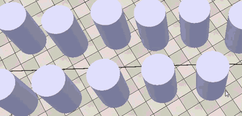
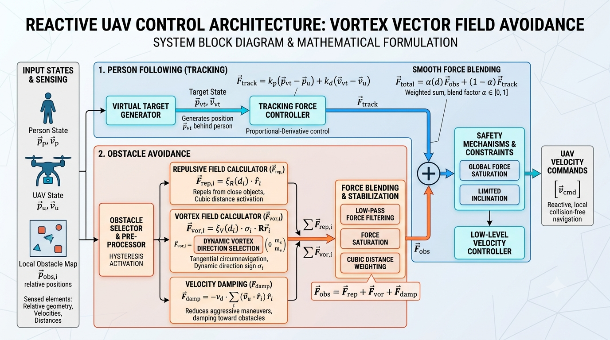
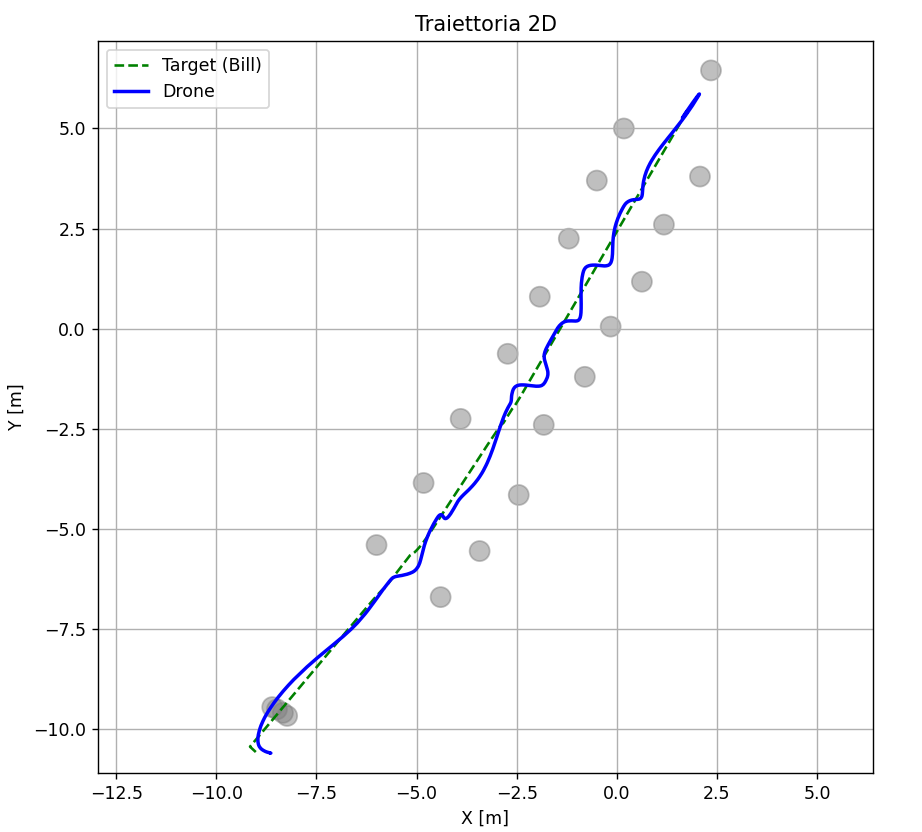
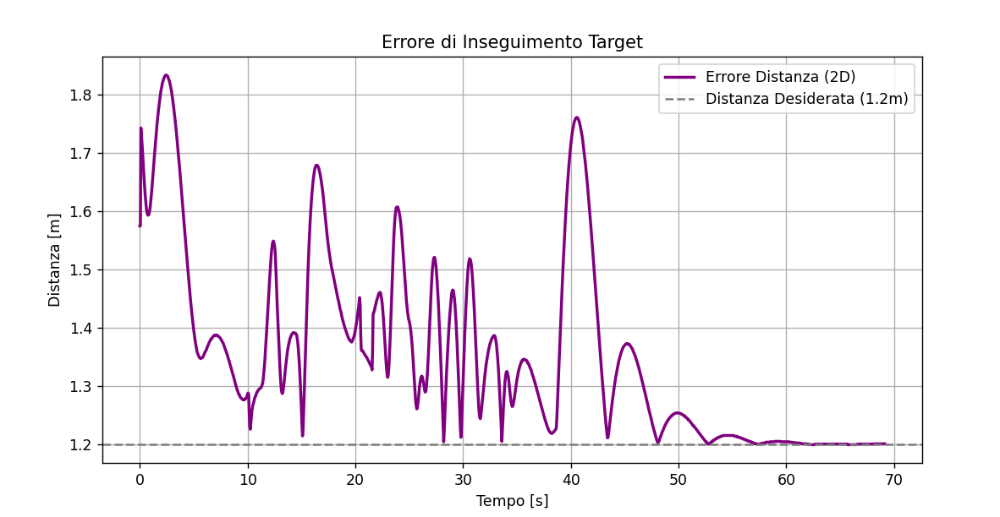
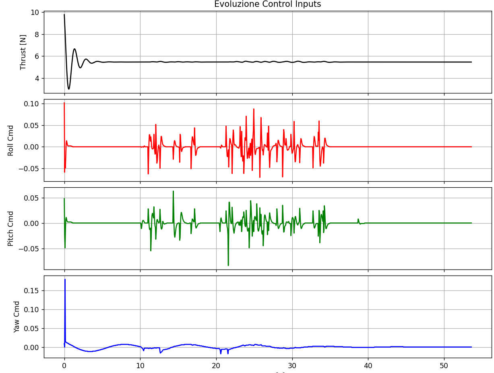

# UAV Person Following with Vortex-Based Obstacle Avoidance

<p align="center">
  
</p>

<p align="center">
<b>Reactive quadrotor person-following in cluttered environments, implemented in CoppeliaSim.</b>
</p>

Elective in Robotics, M.Sc. in Artificial Intelligence and Robotics, Sapienza University of
Rome, academic year 2025-2026.

## Overview

A quadrotor has to hold station behind a walking person while static obstacles enter and
leave its sensing range. The two objectives conflict: pushing hard on the tracking error
drives the UAV into obstacles, while reacting hard to obstacles throws away the relative
configuration that makes the target observable in the first place.

The controller here is fully reactive. There is no global planner and no map: at every
control step the UAV knows the target pose, reads its proximity sensors, and produces a
thrust and attitude command. Obstacle avoidance is an artificial potential field augmented
with a tangential vortex component, which is what lets the vehicle slide around an obstacle
instead of stalling in front of it.

The interesting part of the project is not that the vortex field works. It is that the
vortex field alone is not enough: Scenario 2 below shows the same controller, run twice with
identical parameters, producing two qualitatively different trajectories. The smoothing,
blending and hysteresis layers were added to fix that, and Scenario 3 shows what they buy.

## Repository layout

```
src/
  1 no obstacles.ttt            CoppeliaSim scene, baseline tracking
  2 obstacles no heuristic.ttt  avoidance active, stabilization disabled
  3 apf.ttt                     full controller
  4 corridor.ttt                narrow passage
  graph_py.py                   plots log_*.csv produced by the scenes
media/                          figures used below
Uav_elective_report.pdf         full report, including the dynamic model
Presentation_multi-rotor UAVs.pdf
```

The Lua controller lives inside each `.ttt` scene as a child script. Running a scene writes
`log_*.csv` (time, thrust, roll, pitch, yaw, drone and target positions, repulsive and
vortex force components); `graph_py.py` picks up the most recent log in its working
directory and regenerates the trajectory, tracking-error and force plots.

## Following strategy

The UAV does not chase the person's position. It chases a virtual target placed a fixed
distance behind them, at a fixed height offset:

```math
p_v = p_t - d_{\mathrm{des}} \thinspace \hat{h}_t , \qquad z_v = z_t + \Delta z
```

with $`d_{\mathrm{des}} = 1.2`$ m and $`\Delta z = 1.5`$ m. The error $`p_v - p`$ is rotated
into the body frame before being mapped into roll and pitch setpoints, so the horizontal
controller always works in the frame it actually commands.

Altitude is held by a PI controller on the height error with velocity feedback; heading is a
PD that aligns the UAV with the direction of travel. Both are deliberately simple, because
the question the project asks is about the avoidance layer, not about attitude control.

In scenarios 2 to 4 the person's own path is generated offline with RRT-Connect through
OMPL. That planner plans for the target, never for the UAV, which stays reactive throughout.

<p align="center">
  
</p>

## Obstacle avoidance

Let $`p`$ be the horizontal position of the UAV and $`p_{\mathrm{obs}}`$ the position of a
detected obstacle:

```math
\mathbf{d} = p_{\mathrm{obs}} - p , \qquad d = \lVert \mathbf{d} \rVert , \qquad
\hat{u} = \frac{\mathbf{d}}{d}
```

### Why not the classical repulsive field

The standard FIRAS potential

```math
F_{\mathrm{rep}}^{\mathrm{FIRAS}} =
K_{\mathrm{rep}} \left( \frac{1}{d} - \frac{1}{d_0} \right) \frac{1}{d^{2}} \thinspace \hat{u}
```

diverges as $`d \to 0`$. In a simulator running at a fixed step that divergence is not a
theoretical concern: one step spent slightly too close to an obstacle produces a force large
enough to saturate the attitude command outright.

This implementation replaces it with a bounded activation. The distance is saturated from
below at $`d_{\mathrm{sat}}`$ and normalised over the influence region:

```math
\sigma(d) = \mathrm{clamp}\!\left(
\frac{d_0 - d}{d_0 - d_{\mathrm{sat}}} , \thinspace 0 , \thinspace 1 \right)
```

```math
F_{\mathrm{rep}} = -K_{\mathrm{rep}} \thinspace \sigma(d)^{3} \thinspace \hat{u}
```

$`\sigma \in [0,1]`$ by construction, so the force is bounded by $`K_{\mathrm{rep}}`$ no
matter how close the UAV gets. The cubic exponent keeps the field nearly inactive across
most of the influence radius and concentrates the response near the obstacle, which avoids
the constant low-level push that a linear law applies even at the boundary.

### Vortex component

A purely repulsive field pushes straight back along $`\hat{u}`$. When the obstacle sits on
the line between the UAV and its target, repulsion and tracking cancel, and the vehicle
stalls or oscillates. Adding a tangential term removes that equilibrium:

```math
\hat{t} = \begin{bmatrix} -\hat{u}_y \\ \hat{u}_x \end{bmatrix} , \qquad
F_{\mathrm{vor}} = s \thinspace K_{\mathrm{vor}} \thinspace \sigma(d)^{3} \thinspace \hat{t}
```

The sense of rotation $`s \in \{-1, +1\}`$ is not fixed. It is chosen from the sign of the
planar cross product between the obstacle direction and the direction $`\hat{g}`$ to the
virtual target,

```math
s = \mathrm{sign}\!\left(
\hat{u}_x \thinspace \hat{g}_y - \hat{u}_y \thinspace \hat{g}_x \right)
```

so the UAV always rounds the obstacle on the side that keeps it moving toward the target.
Picking $`s`$ from the velocity direction instead makes the vehicle commit to whichever side
it happened to approach from, which is worse whenever the target is already turning.

A damping term opposes only the component of velocity pointing into the obstacle:

```math
F_{\mathrm{damp}} = -K_{\mathrm{damp}} \thinspace
\max(0 , \thinspace v^{\top} \hat{u}) \thinspace \hat{u}
```

The one-sided $`\max`$ matters: a symmetric damper would also fight the UAV as it leaves the
obstacle region, slowing the recovery of the following distance.

```math
F_{\mathrm{obs}} = F_{\mathrm{rep}} + F_{\mathrm{vor}} + F_{\mathrm{damp}}
```

## Stabilization

$`F_{\mathrm{obs}}`$ is not applied directly. Three mechanisms sit between it and the
attitude controller, and Scenario 2 exists to show what happens without them.

**Blending.** Rather than switching avoidance on at a threshold, a continuous weight is
computed from the distance to the nearest obstacle $`d_{\mathrm{near}}`$:

```math
\lambda = \mathrm{clamp}\!\left(
\frac{d_{\mathrm{off}} - (d_{\mathrm{near}} + \delta)}{d_{\mathrm{off}} - d_{\mathrm{on}}} ,
\thinspace 0 , \thinspace 1 \right)^{3}
```

The same weight attenuates the tracking setpoint, so the two objectives hand over to each
other instead of competing:

```math
s_{\mathrm{track}} \leftarrow (1 - \kappa \lambda) \thinspace s_{\mathrm{track}}
```

**Low-pass filtering.** Repulsive and vortex components are smoothed independently by a
first-order recursion, which bounds how fast the commanded force can change between steps:

```math
F_k = (1 - \alpha) F_{k-1} + \alpha \thinspace F_k^{\mathrm{raw}}
```

**Saturation and hysteresis.** Each force component is clamped to
$`[-F_{\max} , F_{\max}]`$. Avoidance mode engages below $`d_{\mathrm{on}}`$ and releases
only above $`d_{\mathrm{off}} > d_{\mathrm{on}}`$, so an obstacle sitting near the threshold
cannot make the mode chatter.

## Results

### Scenario 1, baseline tracking

No obstacles, with the target driven along imposed straight and sinusoidal paths rather than
by the planner, to isolate the tracking controller.

<p align="center">

</p>

After the initial transient the UAV path overlaps the target path, including through the
curved segments. The distance error converges to the commanded 1.2 m:

<p align="center">

</p>

The residual ripple tracks curvature changes in the target motion, so it is a lag of the
tracking loop and not an instability. Thrust settles to a near-constant value and yaw
converges to zero.

<p align="center">

</p>

### Scenario 2, avoidance without stabilization

Repulsive and vortex fields active, blending and filtering disabled.

Two runs with identical parameters and identical obstacle layout produce qualitatively
different trajectories. In one the UAV oscillates near the obstacle cluster and recovers
late; in the other it makes a large lateral excursion and never regains the following
configuration within the simulation.

That non-repeatability is the result worth recording. The target motion is unchanged between
the runs, so the divergence comes from the avoidance layer itself: the repulsive component
shows sharp peaks that dominate the total command, the vortex component is present but too
small to redirect the motion, and roll and pitch hit their saturation limits. The avoidance
force acts as an impulsive disturbance rather than as guidance, and once the UAV has been
displaced the tracking loop cannot recover it.

### Scenario 3, full controller

Same fields, with shaping, filtering and blending enabled. Obstacle interactions now cause
bounded local deviations and short transients, and the UAV returns to the desired relative
configuration each time. Roll and pitch show brief bursts during avoidance without sustained
saturation; thrust stays near nominal.

### Scenario 4, corridor

A narrow passage with obstacles on both sides, where avoidance is continuously active and
the UAV cannot go wide. Tracking degrades as expected, with the distance error peaking near
1.8 m during the traversal, but it stays bounded and returns to 1.2 m once the corridor
opens out. Roll and pitch stay within roughly ±0.05 to ±0.1, so the vehicle is making
micro-corrections rather than aggressive tilts, and the corridor interaction shows up in
lateral control without disturbing altitude regulation.

## Parameters

Values for Scenario 3. Scenarios 2 and 4 differ mainly in the avoidance gains and the
smoothing factor; the per-scenario tables are in the report.

| Block | Parameter | Value |
|---|---|---|
| Altitude, PI with velocity feedback | proportional gain | 10.0 |
| | integral gain | 0.2 |
| | velocity feedback gain | −1.5 |
| Following strategy | desired distance $`d_{\mathrm{des}}`$ | 1.2 m |
| | height offset $`\Delta z`$ | 1.5 m |
| | lateral offset | 0.0 m |
| Avoidance field | repulsive gain $`K_{\mathrm{rep}}`$ | 0.7 |
| | vortex gain $`K_{\mathrm{vor}}`$ | 0.7 |
| | damping gain $`K_{\mathrm{damp}}`$ | 0.7 |
| | distance floor $`d_{\mathrm{sat}}`$ | 0.25 m |
| | drone radius, clearance | 0.35 m |
| Stabilization | smoothing factor $`\alpha`$ | 0.4 |
| | force saturation $`F_{\max}`$ | 1.0 |
| | tracking attenuation $`\kappa`$ | 0.5 |
| Horizontal control | position gain, body frame | 0.01 |
| | position derivative gain | 0.5 |
| | attitude derivative gain | 1.5 |
| | maximum tilt | 0.6 rad |
| Yaw, PD | proportional gain | 0.1 |
| | derivative gain | 1.0 |

## Reproducing

Open a scene from `src/` in CoppeliaSim and start the simulation. Each run writes a
`log_*.csv` to the working directory. Then, from that same directory:

```
python src/graph_py.py
```

It reads the most recent log and regenerates the three figures. If `mappa_ostacoli.csv` is
present it is overlaid on the trajectory plot; otherwise only the paths are drawn. Requires
`pandas`, `numpy` and `matplotlib`.

## Limitations

Sensing is ideal. The simulator supplies the target pose and obstacle distances without
noise or delay, so nothing in these results speaks to how the controller behaves under real
estimation error; an EKF between sensing and control is the obvious next step.

Obstacles are static. The vortex direction is chosen from geometry alone, which is enough
for fixed obstacles but has no notion of an obstacle moving toward the UAV.

Narrow passages remain the weak point of the method, and Scenario 4 only partly hides it.
Repulsive contributions from facing walls can cancel, leaving the UAV in an oscillatory
equilibrium along the corridor axis. An influence radius $`d_0`$ that adapts to the local
free space, or a dedicated mode that aligns the field with the passage axis, would address
this directly.

Target acquisition is not solved here either: the person's position comes from the
simulator, where a deployed system would need onboard detection.

## Authors

Francesco Barbetta, Giorgio De Santis, Roberto Passante, Marco Antonio Iossa.

## References

O. Khatib, *Real-Time Obstacle Avoidance for Manipulators and Mobile Robots*, International
Journal of Robotics Research, 1986, for the repulsive formulation. The vortex construction
and the choice of rotation sense follow the vortex-field literature discussed in the report,
which also contains the full quadrotor model and the per-scenario parameter tables.
